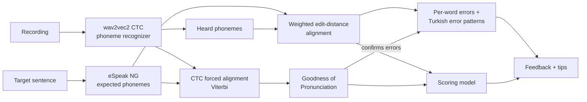
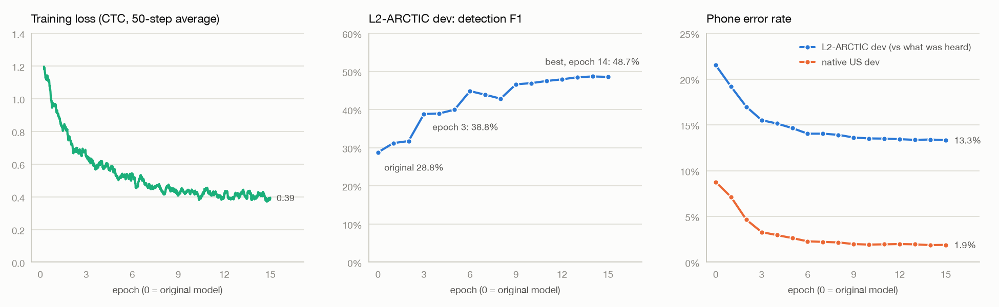

# Pronunciation Coach

**Phoneme-level English pronunciation feedback for Turkish speakers.** Read a sentence aloud, see which words and sounds went wrong, and get targeted tips (in English and Turkish) for the mistakes Turkish speakers make most often.

🤗 **Live demo:** [huggingface.co/spaces/DavutKursun/pronunciation-coach](https://huggingface.co/spaces/DavutKursun/pronunciation-coach)

<!-- Add a short GIF of the demo here: record yourself using it. It is the first thing people look at. -->

## What it does

- Colors every word by how well it was pronounced, with sound-by-sound details in IPA
- Detects error patterns typical of Turkish speakers and explains how to fix them:

| Pattern | Example | How it is detected |
| --- | --- | --- |
| "th" said as t/d/s/z | *think* → "tink" | substitution of /θ/ or /ð/ |
| w and v mixed up | *west* → "vest" | substitution /w/ ↔ /v/ |
| short vs long vowels | *ship* ↔ *sheep*, *pull* ↔ *pool* | /ɪ/ ↔ /iː/, /ʊ/ ↔ /uː/ |
| /æ/ said as e or a | *bad* → "bed" | substitution of /æ/ |
| final consonant devoicing | *bed* → "bet" | voiced → voiceless in the word's final consonant group |
| extra vowel in consonant groups | *school* → "is-chool" | vowel inserted before or inside a cluster |
| /ŋ/ followed by g, or said as n | *singing* → "sing-ging" | insertion of /ɡ/ after /ŋ/ |
| tapped or rolled r | *red* with Turkish r | /ɹ/ heard as /r/ or /ɾ/ |

- Gives an overall 0–10 score from a model trained on expert ratings (speechocean762)
- Plays a synthetic reference pronunciation (eSpeak NG)

## How it works



1. **Phoneme recognition.** [`facebook/wav2vec2-lv-60-espeak-cv-ft`](https://huggingface.co/facebook/wav2vec2-lv-60-espeak-cv-ft) turns audio into IPA phonemes (one prediction every 20 ms, decoded with greedy CTC). The model is multilingual, so decoding is limited to English phonemes and sounds Turkish speakers typically use (tapped r, Turkish vowels…); it cannot "hear" a Mandarin tone or a Russian soft consonant.
2. **Expected phonemes.** `phonemizer` + eSpeak NG convert each word of the target sentence into the phonemes a US English speaker would say, in the same phoneme style the recognizer was trained on.
3. **Alignment** (`pronunciation/align.py`). A weighted edit distance solved with dynamic programming, plus a backtrace, finds which sounds were matched, substituted, skipped or added. Costs are phonetically motivated: accepted accent variants (the American flap in *better*, reduced vowels in *to/for/the*) are free, vowel↔vowel swaps are cheaper than vowel↔consonant ones, and acceptance is directional (*happy* may end in /ɪ/, but *ship* said with /iː/ is an error). Before /r/, where English has no *ship/sheep* contrast, short and long vowels are both accepted (*here*, *sure*, *zero*).
4. **Error patterns** (`pronunciation/feedback.py`). Each difference is attributed to a word and matched against the patterns above, using its position (for example, only the final consonant group counts for devoicing). A difference is only reported when GOP confirms it (step 5).
5. **Goodness of Pronunciation** (`pronunciation/ctc.py`). The expected phonemes are force-aligned to the audio with the Viterbi algorithm over the CTC state graph, written from scratch in NumPy. For each phoneme, the log-posterior ratio against the best competing phoneme shows how confidently it was produced. GOP also double-checks the feedback: greedy decoding can turn a near tie into a heard error, so a word's differences are reported only if its lowest GOP is below −2.5, meaning some expected sound was at least ~12 times less likely than the model's favourite. Otherwise they are treated as a likely mishearing. Differences that match a typical Turkish-speaker pattern need less evidence (GOP below −1.0), because learners are likely to make them. Added sounds of a known pattern (*is-chool*, *sing-ging*) are always reported, because GOP only scores the expected sounds. The −2.5 threshold was chosen on the speechocean762 training split (`scripts/evaluate_words.py --sweep`), the −1.0 one on the dev half of the Speech Accent Archive Turkish speakers (`scripts/evaluate_saa.py`).
6. **Scoring model** (`scripts/train_scorer.py`). 17 features (alignment error rates, word scores, GOP statistics, speaking rate) feed a regression model trained to predict expert sentence scores. Models are selected with speaker-grouped cross-validation on the training set and evaluated once on the official test set.

## Results

The results below belong to **v1**, the rule-based version tagged [`v1.0`](https://github.com/DavutKursun/pronunciation-coach/tree/v1.0) in git. v2 work (a learned error detector and a recognizer fine-tuned on non-native speech) is compared with it using `scripts/run_experiment.py` and `scripts/compare_experiments.py`.

Evaluated on the speechocean762 test set (2,500 utterances, speakers not seen in training). PCC = Pearson correlation with the expert scores.

| Model | CV PCC (train speakers) | Test PCC | Test MSE |
| --- | --- | --- | --- |
| Baseline: phone accuracy only | – | – | – |
| Ridge regression | – | – | – |
| Gradient boosting | – | – | – |

**Word-level error detection** on the same test set: does the feedback flag the words the experts did not score as perfect (word accuracy below 10)? No threshold or rule was tuned on it.

| Words | Expert: wrong | False alarm | Recall | Precision | F1 | Word score PCC |
| --- | --- | --- | --- | --- | --- | --- |
| – | – | – | – | – | – | – |

<!-- Fill in from the tables printed by scripts/train_scorer.py (also saved in results/metrics.json). -->

False alarm = correct words we flagged; recall = wrong words we flagged; precision = flagged words that were really wrong. `scripts/evaluate_words.py` (speechocean762, val speakers of the train split) and `scripts/evaluate_saa.py` (Turkish speakers of the Speech Accent Archive, with an error-level catch rate) report the same metrics during development.

### Real Turkish speakers: Speech Accent Archive

In the [Speech Accent Archive](https://accent.gmu.edu/) every speaker reads the same paragraph ("Please call Stella…") and trained phoneticians transcribe it in IPA. 24 native Turkish speakers and 20 US English speakers with a text transcription were split by speaker into a dev half, used to choose rules and thresholds, and a test half, evaluated once at the end. A word is wrong when the expert's transcription differs from the expected pronunciation; brackets are 95% confidence intervals from resampling speakers (bootstrap).

**Main labels** (a word is wrong when the expert transcription differs from the expected phonemes outside our accepted variants (flap, reduced vowels, weak forms of function words...))

| | Dev (10 English / 12 Turkish speakers) | Test (10 English / 12 Turkish speakers) |
| --- | --- | --- |
| English speakers: false alarm | 2.1% [0.8%–3.8%] | 1.7% [0.3%–3.2%] |
| Turkish speakers: false alarm | 7.1% [3.7%–12.0%] | 11.4% [6.5%–17.7%] |
| Turkish speakers: recall | 42.4% [32.7%–50.1%] | 33.5% [24.7%–42.9%] |
| Turkish speakers: precision | 82.3% [77.8%–86.5%] | 70.1% [61.0%–79.4%] |
| Turkish speakers: F1 | 0.559 [0.469–0.624] | 0.454 [0.362–0.529] |
| Turkish speakers: error-level catch | 39.7% [30.4%–47.1%] | 29.1% [21.0%–37.2%] |

**Raw labels** (a word is wrong when the expert transcription differs from the expected phonemes at all (only narrow-IPA detail and vowel length are ignored))

| | Dev (10 English / 12 Turkish speakers) | Test (10 English / 12 Turkish speakers) |
| --- | --- | --- |
| English speakers: false alarm | 2.0% [0.2%–4.2%] | 1.8% [0.5%–3.3%] |
| Turkish speakers: false alarm | 8.4% [3.1%–15.1%] | 10.6% [6.1%–16.6%] |
| Turkish speakers: recall | 30.2% [21.5%–38.7%] | 27.3% [19.4%–35.1%] |
| Turkish speakers: precision | 87.1% [81.9%–93.2%] | 81.6% [76.5%–87.0%] |
| Turkish speakers: F1 | 0.449 [0.345–0.533] | 0.409 [0.313–0.490] |

**Per pattern, Turkish speakers** (errors the expert heard → share we found on the same sound)

| Pattern | Dev | Test |
| --- | --- | --- |
| 'th' as in think /θ/ | 89% of 35 | 79% of 28 |
| 'th' as in this /ð/ | 29% of 49 | 17% of 47 |
| 'w' as in west /w/ | 64% of 33 | 58% of 33 |
| long 'ee' as in sheep /iː/ | 50% of 6 | 83% of 6 |
| short 'i' as in ship /ɪ/ | 18% of 40 | 4% of 26 |
| 'a' as in cat /æ/ | 48% of 27 | 23% of 22 |
| short 'oo' as in pull /ʊ/ | 0% of 7 | 0% of 8 |
| long 'oo' as in pool /uː/ | 0% of 3 | – |
| 'er' as in bird /ɜː/ | 0% of 1 | 0% of 1 |
| 'ng' as in sing /ŋ/ | 0% of 3 | 33% of 3 |
| English 'r' /ɹ/ | 24% of 29 | 0% of 24 |
| voiced sound at the end of a word | 38% of 146 | 36% of 126 |
| extra vowel in a consonant group | 45% of 11 | 75% of 4 |

The main labels leave out differences we accept as correct English (the American flap in *better*, *æn* for *and*…), while the raw labels count every deviation the expert wrote. Both give the same picture (about 2% false alarms for native speakers; for Turkish speakers 70–87% of the flagged words are really wrong, but most wrong words are missed), so the result does not hinge on our list of accepted variants.

The test half is clearly worse than the dev half for Turkish speakers (recall 42% → 34%, precision 82% → 70%, F1 0.56 → 0.45), and the gap is smaller with the raw labels (F1 0.45 → 0.41), which do not depend on the variants we accepted while looking at dev. So part of the dev result is overfitting to the 12 dev speakers; the rest is speaker-to-speaker variation, which is large (per-speaker recall ranges from 0% to 65%). The test numbers are the ones to quote.

### v2 experiments (development sets only)

**v2-2: a learned error detector.** A gradient-boosting model (`pronunciation/detector.py`, `scripts/train_detector.py`) predicts an error probability for every expected sound from GOP scores, the probability of the typical Turkish replacement, the alignment, the sound class, position and timing. It is trained on the speechocean762 phone scores of the "fit" speakers; its red/yellow thresholds are chosen on the Speech Accent Archive dev half. Compared with v1 on the same speakers (paired bootstrap over speakers; "real" = the 95% interval excludes zero):

| Metric | v1 | v2-2 | Difference | 95% CI | Real? |
| --- | --- | --- | --- | --- | --- |
| SAA dev, Turkish: recall | 42.4% | 11.4% | -31.0% | [-37.1%, -23.7%] | yes |
| SAA dev, Turkish: precision | 82.3% | 71.9% | -10.3% | [-23.9%, +0.5%] | no |
| SAA dev, Turkish: F1 | 55.9% | 19.6% | -36.3% | [-42.5%, -29.0%] | yes |
| SAA dev, Turkish: false alarm | 7.1% | 3.5% | -3.7% | [-7.2%, -1.1%] | yes |
| SAA dev, Turkish: error-level catch | 39.7% | 7.8% | -31.9% | [-38.3%, -24.1%] | yes |
| SAA dev, Turkish: final devoicing catch | 38.4% | 2.7% | -35.6% | [-48.1%, -21.6%] | yes |
| SAA dev, Turkish: z → s catch | 38.9% | 2.2% | -36.7% | [-56.8%, -19.4%] | yes |
| SAA dev, Turkish: ð catch | 28.6% | 0.0% | -28.6% | [-41.7%, -16.4%] | yes |
| SAA dev, Turkish: θ catch | 88.6% | 2.9% | -85.7% | [-96.9%, -70.6%] | yes |
| SAA dev, English: false alarm | 2.1% | 2.0% | -0.2% | [-1.0%, +0.6%] | no |
| speechocean val: recall | 83.5% | 81.8% | -1.7% | [-5.8%, +0.3%] | no |
| speechocean val: precision | 31.8% | 39.6% | +7.7% | [+5.5%, +10.1%] | yes |
| speechocean val: false alarm | 26.8% | 18.8% | -8.1% | [-10.3%, -6.2%] | yes |
| speechocean val: F1 | 46.1% | 53.4% | +7.3% | [+5.3%, +9.2%] | yes |

The detector is better on speechocean762 (the kind of speakers it was trained on) but much worse on Turkish speakers: speechocean's Mandarin-speaking experts rarely mark the typical Turkish errors (θ, ð, final devoicing) as wrong, so the model learns to ignore the very signals that matter here, even though they are in the recognizer's output (for example, the probability of *s* in the frames of a final *z* separates the experts' z → s errors with AUC 0.70 on dev). It is therefore not shipped with the demo, which keeps using v1; `python scripts/train_detector.py` rebuilds it. It is not retrained for the fine-tuned recognizer below: the label problem stays the same with any recognizer.

**v2-3: a recognizer fine-tuned to hear the errors.** v2-2 showed that a model trained on labels that ignore Turkish errors learns to ignore them. So the recognizer itself was fine-tuned on what trained annotators *heard*: [L2-ARCTIC](https://psi.engr.tamu.edu/l2-arctic-corpus/) sentences of 12 non-native speakers (1,626 hand-annotated sentences; the target is our expected eSpeak phonemes with each annotated error applied, e.g. *these* → /d iː s/), plus 4,424 recordings of four native US speakers of CMU ARCTIC, weighted equally so native speech stays "correct" (`scripts/build_finetune_data.py`, `scripts/finetune_recognizer.py`). Training ran for 15 epochs (58 minutes) on a free Kaggle T4 GPU (`notebooks/finetune_kaggle.ipynb`). The fine-tuned model is CC BY-NC 4.0 because of L2-ARCTIC, so the app keeps the original recognizer as its default (`MODEL_ID` switches, see the license section).

<picture>
  <source media="(prefers-color-scheme: dark)" srcset="results/finetune/training_curves_dark.png">
  
</picture>

<details><summary>The same numbers per epoch</summary>

| Epoch | L2 dev F1 | precision | recall | L2 dev PER (vs heard) | native dev PER | training loss |
| --- | --- | --- | --- | --- | --- | --- |
| 0 (original) | 28.8% | 33.6% | 25.2% | 21.5% | 8.8% | – |
| 1 | 31.2% | 38.0% | 26.5% | 19.2% | 7.1% | 1.06 |
| 2 | 31.8% | 40.7% | 26.1% | 17.0% | 4.7% | 0.81 |
| 3 | 38.8% | 47.6% | 32.8% | 15.5% | 3.3% | 0.67 |
| 4 | 39.0% | 48.9% | 32.4% | 15.1% | 3.0% | 0.60 |
| 5 | 40.0% | 51.4% | 32.7% | 14.6% | 2.6% | 0.56 |
| 6 | 44.9% | 54.2% | 38.3% | 14.0% | 2.3% | 0.53 |
| 7 | 43.9% | 53.5% | 37.2% | 14.0% | 2.2% | 0.49 |
| 8 | 42.9% | 53.8% | 35.6% | 13.9% | 2.2% | 0.45 |
| 9 | 46.6% | 55.7% | 40.1% | 13.6% | 2.0% | 0.44 |
| 10 | 46.9% | 55.4% | 40.7% | 13.5% | 1.9% | 0.43 |
| 11 | 47.5% | 55.3% | 41.7% | 13.5% | 2.0% | 0.42 |
| 12 | 47.9% | 55.5% | 42.2% | 13.4% | 2.0% | 0.41 |
| 13 | 48.5% | 56.0% | 42.8% | 13.4% | 2.0% | 0.40 |
| 14 | 48.7% | 55.5% | 43.4% | 13.4% | 1.9% | 0.41 |
| 15 | 48.6% | 56.0% | 42.9% | 13.3% | 1.9% | 0.40 |

</details>

**L2-ARCTIC dev** (6 speakers the model never heard, `scripts/evaluate_l2arctic.py`). These numbers are **optimistic**: all 300 annotated L2-ARCTIC sentences are also read by the training speakers, and the native dev set uses the same four CMU speakers as training (other sentences). They show what the model learned, not how it does on new text.

| Recognizer | PER vs heard | PER vs expected | MDD precision | recall | F1 | diagnosis accuracy | native dev PER | native sounds flagged |
| --- | --- | --- | --- | --- | --- | --- | --- | --- |
| original | 21.5% | 13.7% | 33.6% | 25.2% | 28.8% | 62.4% | 8.7% | 4.5% |
| fine-tuned, epoch 3 | 15.5% | 10.3% | 47.6% | 32.8% | 38.8% | 78.2% | 3.3% | 2.4% |
| fine-tuned, epoch 14 (best) | 13.4% | 11.0% | 55.5% | 43.3% | 48.7% | 82.3% | 1.9% | 1.5% |

Share of the annotators' errors where the recognizer did not output the expected sound:

| Error the annotator heard | errors | original | epoch 3 | epoch 14 (best) |
| --- | --- | --- | --- | --- |
| z → s | 441 | 7% | 52% | 65% |
| θ → t | 27 | 37% | 37% | 59% |
| ð → d | 328 | 3% | 31% | 67% |
| ɪ → iː | 134 | 10% | 29% | 53% |
| w → v | 6 | 17% | 0% | 0% |
| æ → ɛ | 36 | 6% | 3% | 3% |
| ɹ → ɾ | 108 | 16% | 33% | 46% |

**Speech Accent Archive dev: the real question.** Different text, Turkish speakers, the same v1 rules. v1's GOP thresholds were chosen for the original recognizer's probabilities, so they were chosen again for every recognizer on SAA dev (`scripts/tune_gop_thresholds.py`, `pronunciation/thresholds.py`): the pair with the most Turkish recall while precision stays at least 70% and native false alarms at most 2.5%. As the thresholds are then chosen and measured on the same speakers, the honest estimate comes from speaker cross-validation (the thresholds for each speaker are chosen without them). The original recognizer gets the same treatment, so the comparison is fair.

| System | Thresholds | Turkish precision | recall | F1 | error-level catch | native false alarm |
| --- | --- | --- | --- | --- | --- | --- |
| v1 | as is: -2.5 / -1 | 82.3% | 42.4% | 0.559 | 39.7% | 2.1% |
| v1 | re-selected (dev, optimistic): -2 / 0 | 79.2% | 48.5% | 0.601 | 43.3% | 2.3% |
| v1 | re-selected, honest (CV): per fold | 79.2% | 48.5% | 0.601 | 42.5% | 2.4% |
| v1 | no GOP check (recognizer alone): none / none | 65.3% | 57.9% | 0.614 | 47.7% | 12.1% |
| v2-3-best | as is: -2.5 / -1 | 85.6% | 52.6% | 0.652 | 47.9% | 1.0% |
| v2-3-best | re-selected (dev, optimistic): -1 / none | 82.0% | 65.7% | 0.729 | 56.5% | 2.4% |
| v2-3-best | re-selected, honest (CV): per fold | 81.3% | 64.0% | 0.716 | 55.5% | 2.6% |
| v2-3-best | no GOP check (recognizer alone): none / none | 73.7% | 71.5% | 0.726 | 59.3% | 6.8% |
| v2-3-epoch3 | as is: -2.5 / -1 | 84.6% | 47.1% | 0.605 | 45.7% | 2.4% |
| v2-3-epoch3 | re-selected (dev, optimistic): -1.5 / -1 | 83.6% | 49.3% | 0.620 | 47.5% | 2.4% |
| v2-3-epoch3 | re-selected, honest (CV): per fold | 83.6% | 51.0% | 0.633 | 47.5% | 2.9% |
| v2-3-epoch3 | no GOP check (recognizer alone): none / none | 74.5% | 68.1% | 0.712 | 59.1% | 8.8% |

Error-level catch per pattern (Turkish speakers):

| System | final devoicing | z → s | ð | θ | w → v | ɪ → i | r |
| --- | --- | --- | --- | --- | --- | --- | --- |
| v1 (as is) | 38% | 39% | 29% | 89% | 64% | 18% | 24% |
| v1 (re-selected, honest (CV)) | 40% | 40% | 33% | 94% | 70% | 20% | 31% |
| v2-3-best (as is) | 52% | 67% | 84% | 77% | 33% | 30% | 31% |
| v2-3-best (re-selected, honest (CV)) | 60% | 77% | 90% | 91% | 36% | 40% | 38% |
| v2-3-epoch3 (as is) | 60% | 69% | 45% | 74% | 24% | 30% | 17% |
| v2-3-epoch3 (re-selected, honest (CV)) | 62% | 73% | 55% | 83% | 27% | 35% | 21% |

Honest (cross-validated) comparison, v1 → fine-tuned (epoch 14), paired bootstrap over speakers; "real" = the 95% interval excludes zero:

| Metric | v1 (CV) | v2-3-best (CV) | Difference | 95% CI | Real? |
| --- | --- | --- | --- | --- | --- |
| SAA dev, Turkish: recall | 48.5% | 64.0% | +15.5% | [+10.2%, +21.8%] | yes |
| SAA dev, Turkish: precision | 79.2% | 81.3% | +2.2% | [-4.0%, +7.4%] | no |
| SAA dev, Turkish: F1 | 60.1% | 71.6% | +11.5% | [+8.1%, +15.5%] | yes |
| SAA dev, Turkish: false alarm | 10.0% | 11.5% | +1.5% | [-3.9%, +5.6%] | no |
| SAA dev, Turkish: error-level catch | 42.5% | 55.5% | +13.0% | [+7.3%, +19.4%] | yes |
| SAA dev, Turkish: final devoicing catch | 39.7% | 60.3% | +20.5% | [+8.5%, +32.4%] | yes |
| SAA dev, Turkish: z → s catch | 40.0% | 76.7% | +36.7% | [+23.0%, +51.1%] | yes |
| SAA dev, Turkish: ð catch | 32.7% | 89.8% | +57.1% | [+38.5%, +73.1%] | yes |
| SAA dev, Turkish: θ catch | 94.3% | 91.4% | -2.9% | [-20.0%, +15.0%] | no |
| SAA dev, Turkish: w catch | 69.7% | 36.4% | -33.3% | [-46.0%, -18.2%] | yes |
| SAA dev, Turkish: ɪ → i catch | 20.0% | 40.0% | +20.0% | [+6.7%, +34.1%] | yes |
| SAA dev, Turkish: r catch | 31.0% | 37.9% | +6.9% | [-8.0%, +21.1%] | no |
| SAA dev, English: false alarm | 2.4% | 2.6% | +0.2% | [-1.5%, +1.7%] | no |

The early checkpoint (epoch 3) was kept in case the best one had won L2-ARCTIC dev by memorizing its sentences; on SAA dev it is clearly worse than epoch 14 (honest recall 51.0% vs 64.0%, difference -13.0% [-19.4%, -7.2%]; ð catch 55.1% vs 89.8%), so the late checkpoint did not just memorize.

**Canonical bias.** At the sounds the Speech Accent Archive expert marked wrong (Turkish speakers, before any GOP check), the original recognizer wrote the expected sound in 52.3% of cases and the fine-tuned one in 40.7%; it wrote the expert's own sound in 31.9% vs 39.3%. On whole paragraphs the phone error rate against the expert barely moves, because most of it is transcription convention (even native speakers are 23–25% away from their expert transcription):

| Recognizer | Turkish: PER vs expert | vs expected | native: PER vs expert | vs expected |
| --- | --- | --- | --- | --- |
| original | 34.9% | 24.2% | 23.4% | 13.8% |
| fine-tuned (best) | 34.7% | 21.8% | 25.3% | 3.8% |

**Regression checks** (v1 → fine-tuned with the new thresholds): speechocean762's Mandarin-speaking experts are lenient, so the stricter system flags more words they accept; on the synthetic Kokoro set it catches fewer errors: an extra vowel before a consonant cluster is caught 10% of the time instead of 98% (the added vowel right after "say" in the carrier sentence goes unheard; on SAA dev 7 of 11 such errors are caught vs 5 for v1), ð → z 35% vs 65%, æ → ɛ 58% vs 81%.

| Metric | v1 | v2-3-best-tuned | Difference | 95% CI | Real? |
| --- | --- | --- | --- | --- | --- |
| speechocean val: recall | 83.5% | 92.8% | +9.3% | [+5.7%, +13.8%] | yes |
| speechocean val: precision | 31.8% | 27.3% | -4.5% | [-7.1%, -2.2%] | yes |
| speechocean val: false alarm | 26.8% | 37.0% | +10.2% | [+7.5%, +12.9%] | yes |
| speechocean val: F1 | 46.1% | 42.2% | -3.9% | [-6.8%, -1.1%] | yes |
| synthetic Kokoro: catch | 88.7% | 77.6% | -11.1% | [-14.9%, -7.1%] | yes |
| synthetic Kokoro: false alarm | 3.6% | 6.5% | +3.0% | [+0.6%, +5.6%] | yes |

**v2 targets on SAA dev** (the final check is on the SAA test half in v2-4):

| Target (SAA dev, Turkish speakers) | Goal | v1 | v2-3 chosen, on all dev speakers | v2-3 chosen, honest (CV) | Met (honest)? |
| --- | --- | --- | --- | --- | --- |
| Turkish precision | >= 70% | 82.3% | 82.0% | 81.3% | yes |
| Turkish recall | >= 50% (stretch 55%) | 42.4% | 65.7% | 64.0% | yes |
| Native false alarm | <= 2.5% | 2.1% | 2.4% | 2.6% | no |
| Final devoicing catch | >= 60% | 38.4% | 62.3% | 60.3% | yes |
| ð catch | >= 40% | 28.6% | 89.8% | 89.8% | yes |
| θ catch | >= 75% | 88.6% | 91.4% | 91.4% | yes |
| (z → s alone) | – | 38.9% | 78.9% | 76.7% | – |

**Decision:** continue with the epoch-14 checkpoint and thresholds -1.0 / "always" (a typical Turkish-speaker error is reported whatever its GOP; other differences need a GOP below -1.0). Honest dev estimate: precision 81.3%, recall 64.0%, F1 0.716. Known weak spots to watch on the test sets: **w → v** (caught 36% instead of 70%: the model now tends to hear a Turkish [v] or [β] as w; L2-ARCTIC has few such errors to learn from), native false alarms just above the limit (2.6%), final devoicing just at 60%, "into" heard with /uː/ for native speakers, and the regressions above.

Examples from SAA dev (`scripts/saa_examples.py`):

**Turkish speakers: real errors v2-3-best-tuned catches and v1 missed**

| Speaker | Word | Expected | Expert wrote | v1 heard | v2-3-best-tuned heard | v2-3-best-tuned reports |
| --- | --- | --- | --- | --- | --- | --- |
| turkish1 | kids | /k ɪ d z/ | [kɪd̥s] | /k ɪ d z/ | /k ɪ d s/ | z → s |
| turkish1 | the | /ð ə/ | [d̪ə] | /ð ə/ | /d ə/ | ð → d |
| turkish12 | three | /θ ɹ iː/ | [t̪riː] | /t ɹ iː/ | /t ɹ iː/ | θ → t |
| turkish2 | five | /f aɪ v/ | [faɪf] | /f aɪ v/ | /f aɪ f/ | v → f |
| turkish1 | and | /æ n d/ | [æ̆ntʰ] | /æ n d/ | /æ n t/ | d → t |

**US English speakers: new false alarms of v2-3-best-tuned**

| Speaker | Word | Expected | Expert wrote | v1 heard | v2-3-best-tuned heard | v2-3-best-tuned reports |
| --- | --- | --- | --- | --- | --- | --- |
| english1 | into | /ɪ n t ʊ/ | [ɪ̃ntə] | /ɪ n t ʊ/ | /ɪ n t uː/ | ʊ → uː |
| english142 | into | /ɪ n t ʊ/ | [ɪ̃nɾə] | /ɪ n t ə/ | /ɪ n t uː/ | ʊ → uː |
| english158 | into | /ɪ n t ʊ/ | [ɪ̃ntə] | /ɪ n t ə/ | /ɪ n t uː/ | ʊ → uː |
| english161 | Please | /p l iː z/ | [pʰliːz̥] | /p l iː z/ | /p l iː s/ | z → s |
| english161 | thick | /θ ɪ k/ | [θɪk] | /θ ɪ k/ | /t ɪ k/ | θ → t |

## Project structure

```
pronunciation/
  phonemes.py     phoneme classes, accepted variants, Turkish error patterns and tips
  g2p.py          text -> expected phonemes (phonemizer + eSpeak NG)
  align.py        weighted edit-distance alignment (dynamic programming)
  feedback.py     per-word results and error-pattern detection
  ctc.py          greedy CTC decoding, Viterbi forced alignment, GOP scores
  recognizer.py   wav2vec2 phoneme recognizer
  assess.py       the full pipeline and the scoring features
  audio.py        audio loading and resampling to 16 kHz
  saa.py          Speech Accent Archive: narrow IPA -> our phonemes, expert labels
  metrics.py      word- and error-level detection metrics, bootstrap intervals, system comparison
  cache.py        recognizer output cached per model and data set
  systems.py      a "system": recognizer + decision mechanism + settings (for experiments)
  speechocean.py  speechocean762 phone labels (ARPAbet) moved onto our expected phonemes
  detector.py     v2 learned error detector: features per expected sound, red/yellow decision
  l2arctic.py     L2-ARCTIC annotations -> what the annotator heard, in our phoneme style
  thresholds.py   choose the GOP confirmation thresholds per recognizer, with speaker cross-validation
scripts/
  extract_features.py   run the pipeline on speechocean762
  evaluate_words.py     word-level false alarm / catch rates on speechocean762 (val speakers)
  split_speechocean.py  speaker-level fit/val split of speechocean762 train (data/speechocean_split.json)
  download_saa.py       download Turkish and US English speakers from the Speech Accent Archive
  split_saa.py          speaker-level dev/test split (data/saa_split.json)
  evaluate_saa.py       word-level evaluation against expert IPA transcriptions
  smoke_test_real_model.py  quick check of the real model on synthesized sentences
  synthetic_errors.py   synthetic test set of Turkish-speaker errors (eSpeak NG, Kokoro)
  kokoro_tts.py         Kokoro-82M synthesis, run in its own environment (.venv-tts)
  run_experiment.py     run a system on every development set -> results/experiments/<name>.json
  compare_experiments.py  compare two systems on the same speakers (paired bootstrap)
  train_detector.py     train the v2 error detector and choose its thresholds (one command)
  prepare_l2arctic.py   extract the annotated L2-ARCTIC sentences (16 kHz FLAC) from the release zip
  build_finetune_data.py  fine-tuning targets from L2-ARCTIC + CMU ARCTIC -> data/finetune/*.jsonl
  evaluate_l2arctic.py  PER and mispronunciation detection (MDD) of a recognizer on L2-ARCTIC
  finetune_recognizer.py  fine-tune the recognizer (run on Kaggle: notebooks/finetune_kaggle.ipynb)
  package_kaggle.py     pack the fine-tuning data and code into one zip for Kaggle
  tune_gop_thresholds.py  re-choose the GOP thresholds for each recognizer on SAA dev (honest CV estimate)
  saa_examples.py       SAA dev words where two systems disagree (new catches, new false alarms)
  plot_training.py      fine-tuning curves for the README (results/finetune/)
experiments/      system definitions (v1.json, ...)
  train_scorer.py       train and evaluate the scoring model
  deploy_space.py       publish the demo to Hugging Face Spaces
tests/            unit tests (pytest), no model download needed
app.py            Gradio demo
notebooks/colab.ipynb   feature extraction and training on a free Colab GPU
```

## Quickstart (macOS)

```bash
brew install espeak-ng python@3.12
python3.12 -m venv .venv && source .venv/bin/activate
pip install -r requirements-dev.txt

pytest                     # unit tests, about 5 seconds
python app.py              # first run downloads the recognizer (about 1.2 GB)
```

On Linux: `sudo apt-get install espeak-ng`. On Apple Silicon the recognizer runs on the GPU (MPS) automatically; if you get an MPS error, start it with `PC_DEVICE=cpu python app.py`.

## Train the scoring model

Open `notebooks/colab.ipynb` in Google Colab with a free T4 GPU. It extracts features for all 5,000 speechocean762 utterances, trains the scorer and prints the results table. Then put `models/scorer.joblib` and `results/metrics.json` into the repository.

## Deploy the demo

```bash
hf auth login
python scripts/deploy_space.py DavutKursun/pronunciation-coach
```

The free CPU hardware of Hugging Face Spaces is enough.

## Limitations

- The reference accent is US English (eSpeak `en-us`). Some British pronunciations are accepted as variants, but not all.
- eSpeak gives one pronunciation per word. Words with several correct pronunciations can cause false alarms.
- The recognizer can mishear, especially with background noise. Treat the feedback as a guide, not a verdict.
- The recognizer often does not hear some typical Turkish errors. A final *z* said as *s* and *ð* said as *d* are the most common errors that the experts heard and we missed (45 and 36 words in the Speech Accent Archive test half): the model outputs the expected sound, so no rule on its output can catch them. This would need a recognizer fine-tuned on accented speech.
- On real Turkish speakers the feedback is precise but misses many errors: on the Speech Accent Archive test half it finds about a third of the words the experts marked (see Results), from only 12 test speakers.
- The scoring model is trained on speechocean762, whose speakers are Mandarin native speakers (half of them children). The tips target Turkish speakers, but no Turkish-speaker data was used for training.
- Word stress and intonation are not assessed.

## Credits and licenses

- Recognizer: [facebook/wav2vec2-lv-60-espeak-cv-ft](https://huggingface.co/facebook/wav2vec2-lv-60-espeak-cv-ft) (Apache-2.0)
- Data: [speechocean762](https://huggingface.co/datasets/mispeech/speechocean762) ([OpenSLR 101](https://www.openslr.org/101/), CC BY 4.0)
- Evaluation data: [Speech Accent Archive](https://accent.gmu.edu/) (Weinberger, S. H. & Kelley, M. C., George Mason University), recordings and IPA transcriptions [on OSF](https://accent.gmu.edu/download), CC BY-NC-SA 4.0. Used for non-commercial evaluation only; the recordings are downloaded by `scripts/download_saa.py` and are not part of this repository.
- Synthetic test voices (not part of the app): [eSpeak NG](https://github.com/espeak-ng/espeak-ng) and [Kokoro-82M](https://huggingface.co/hexgrad/Kokoro-82M) (Apache-2.0)
- Fine-tuning data (v2-3): [L2-ARCTIC](https://psi.engr.tamu.edu/l2-arctic-corpus/) (Zhao et al., Interspeech 2018), CC BY-NC 4.0, and [CMU ARCTIC](http://festvox.org/cmu_arctic/) (Kominek & Black, Carnegie Mellon University; free for any use with its copyright notice kept). Neither is part of this repository.
- G2P and speech synthesis: [phonemizer](https://github.com/bootphon/phonemizer) and [eSpeak NG](https://github.com/espeak-ng/espeak-ng) (GPL-3.0)
- Code: MIT (see LICENSE)

**Which recognizer, which license.** The app uses the original recognizer (Apache-2.0) by default. A recognizer fine-tuned on L2-ARCTIC (`scripts/finetune_recognizer.py`) inherits the data's **CC BY-NC 4.0** license: non-commercial use only. The recognizer is chosen with one setting, `MODEL_ID` (a Hugging Face id or a local folder), so a commercial version can switch back to the original model:

```bash
MODEL_ID=models/recognizer-l2arctic/best python app.py   # the fine-tuned recognizer (non-commercial)
python app.py                                         # the original one (default)
```
