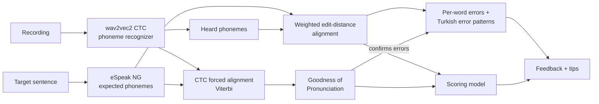

# Pronunciation Coach

**Phoneme-level English pronunciation feedback for Turkish speakers.** Read a sentence aloud, see which words and sounds went wrong, and get targeted tips (in English and Turkish) for the mistakes Turkish speakers make most often.

🤗 **Live demo:** [huggingface.co/spaces/DavutKursun/pronunciation-coach](https://huggingface.co/spaces/DavutKursun/pronunciation-coach)

<!-- Add a short GIF of the demo here: record yourself using it. It is the first thing people look at. -->

## What it does

- Colors every word by how well it was pronounced, with sound-by-sound details in IPA
- Detects error patterns typical of Turkish speakers and explains how to fix them:

| Pattern | Example | How it is detected |
| --- | --- | --- |
| "th" said as t/d/s/z | *think* → "tink" | substitution of /θ/ or /ð/ |
| w and v mixed up | *west* → "vest" | substitution /w/ ↔ /v/ |
| short vs long vowels | *ship* ↔ *sheep*, *pull* ↔ *pool* | /ɪ/ ↔ /iː/, /ʊ/ ↔ /uː/ |
| /æ/ said as e or a | *bad* → "bed" | substitution of /æ/ |
| final consonant devoicing | *bed* → "bet" | voiced → voiceless in the word's final consonant group |
| extra vowel in consonant groups | *school* → "is-chool" | vowel inserted before or inside a cluster |
| /ŋ/ followed by g, or said as n | *singing* → "sing-ging" | insertion of /ɡ/ after /ŋ/ |
| tapped or rolled r | *red* with Turkish r | /ɹ/ heard as /r/ or /ɾ/ |

- Gives an overall 0–10 score from a model trained on expert ratings (speechocean762)
- Plays a synthetic reference pronunciation (eSpeak NG)

## How it works



1. **Phoneme recognition.** [`facebook/wav2vec2-lv-60-espeak-cv-ft`](https://huggingface.co/facebook/wav2vec2-lv-60-espeak-cv-ft) turns audio into IPA phonemes (one prediction every 20 ms, decoded with greedy CTC). The model is multilingual, so decoding is limited to English phonemes and sounds Turkish speakers typically use (tapped r, Turkish vowels…); it cannot "hear" a Mandarin tone or a Russian soft consonant.
2. **Expected phonemes.** `phonemizer` + eSpeak NG convert each word of the target sentence into the phonemes a US English speaker would say, in the same phoneme style the recognizer was trained on.
3. **Alignment** (`pronunciation/align.py`). A weighted edit distance solved with dynamic programming, plus a backtrace, finds which sounds were matched, substituted, skipped or added. Costs are phonetically motivated: accepted accent variants (the American flap in *better*, reduced vowels in *to/for/the*) are free, vowel↔vowel swaps are cheaper than vowel↔consonant ones, and acceptance is directional (*happy* may end in /ɪ/, but *ship* said with /iː/ is an error). Before /r/, where English has no *ship/sheep* contrast, short and long vowels are both accepted (*here*, *sure*, *zero*).
4. **Error patterns** (`pronunciation/feedback.py`). Each difference is attributed to a word and matched against the patterns above, using its position (for example, only the final consonant group counts for devoicing). A difference is only reported when GOP confirms it (step 5).
5. **Goodness of Pronunciation** (`pronunciation/ctc.py`). The expected phonemes are force-aligned to the audio with the Viterbi algorithm over the CTC state graph, written from scratch in NumPy. For each phoneme, the log-posterior ratio against the best competing phoneme shows how confidently it was produced. GOP also double-checks the feedback: greedy decoding can turn a near tie into a heard error, so a word's differences are reported only if its lowest GOP is below −2.5, meaning some expected sound was at least ~12 times less likely than the model's favourite. Otherwise they are treated as a likely mishearing. Added sounds of a known pattern (*is-chool*, *sing-ging*) are always reported, because GOP only scores the expected sounds. The threshold was chosen on the training split with `scripts/evaluate_words.py --sweep`.
6. **Scoring model** (`scripts/train_scorer.py`). 17 features (alignment error rates, word scores, GOP statistics, speaking rate) feed a regression model trained to predict expert sentence scores. Models are selected with speaker-grouped cross-validation on the training set and evaluated once on the official test set.

## Results

Evaluated on the speechocean762 test set (2,500 utterances, speakers not seen in training). PCC = Pearson correlation with the expert scores.

| Model | CV PCC (train speakers) | Test PCC | Test MSE |
| --- | --- | --- | --- |
| Baseline: phone accuracy only | – | – | – |
| Ridge regression | – | – | – |
| Gradient boosting | – | – | – |

Word level: PCC between our word scores and expert word accuracy = –

<!-- Fill in from the table printed by scripts/train_scorer.py (also saved in results/metrics.json). -->

## Project structure

```
pronunciation/
  phonemes.py     phoneme classes, accepted variants, Turkish error patterns and tips
  g2p.py          text -> expected phonemes (phonemizer + eSpeak NG)
  align.py        weighted edit-distance alignment (dynamic programming)
  feedback.py     per-word results and error-pattern detection
  ctc.py          greedy CTC decoding, Viterbi forced alignment, GOP scores
  recognizer.py   wav2vec2 phoneme recognizer
  assess.py       the full pipeline and the scoring features
  audio.py        audio loading and resampling to 16 kHz
scripts/
  extract_features.py   run the pipeline on speechocean762
  evaluate_words.py     word-level false alarm / catch rates on speechocean762 train
  smoke_test_real_model.py  quick check of the real model on synthesized sentences
  train_scorer.py       train and evaluate the scoring model
  deploy_space.py       publish the demo to Hugging Face Spaces
tests/            unit tests (pytest), no model download needed
app.py            Gradio demo
notebooks/colab.ipynb   feature extraction and training on a free Colab GPU
```

## Quickstart (macOS)

```bash
brew install espeak-ng python@3.12
python3.12 -m venv .venv && source .venv/bin/activate
pip install -r requirements-dev.txt

pytest                     # unit tests, about 5 seconds
python app.py              # first run downloads the recognizer (about 1.2 GB)
```

On Linux: `sudo apt-get install espeak-ng`. On Apple Silicon the recognizer runs on the GPU (MPS) automatically; if you get an MPS error, start it with `PC_DEVICE=cpu python app.py`.

## Train the scoring model

Open `notebooks/colab.ipynb` in Google Colab with a free T4 GPU. It extracts features for all 5,000 speechocean762 utterances, trains the scorer and prints the results table. Then put `models/scorer.joblib` and `results/metrics.json` into the repository.

## Deploy the demo

```bash
hf auth login
python scripts/deploy_space.py DavutKursun/pronunciation-coach
```

The free CPU hardware of Hugging Face Spaces is enough.

## Limitations

- The reference accent is US English (eSpeak `en-us`). Some British pronunciations are accepted as variants, but not all.
- eSpeak gives one pronunciation per word. Words with several correct pronunciations can cause false alarms.
- The recognizer can mishear, especially with background noise. Treat the feedback as a guide, not a verdict.
- The scoring model is trained on speechocean762, whose speakers are Mandarin native speakers (half of them children). The tips target Turkish speakers, but no Turkish-speaker data was used for training.
- Word stress and intonation are not assessed.

## Credits and licenses

- Recognizer: [facebook/wav2vec2-lv-60-espeak-cv-ft](https://huggingface.co/facebook/wav2vec2-lv-60-espeak-cv-ft) (Apache-2.0)
- Data: [speechocean762](https://huggingface.co/datasets/mispeech/speechocean762) ([OpenSLR 101](https://www.openslr.org/101/), CC BY 4.0)
- G2P and speech synthesis: [phonemizer](https://github.com/bootphon/phonemizer) and [eSpeak NG](https://github.com/espeak-ng/espeak-ng) (GPL-3.0)
- Code: MIT (see LICENSE)
